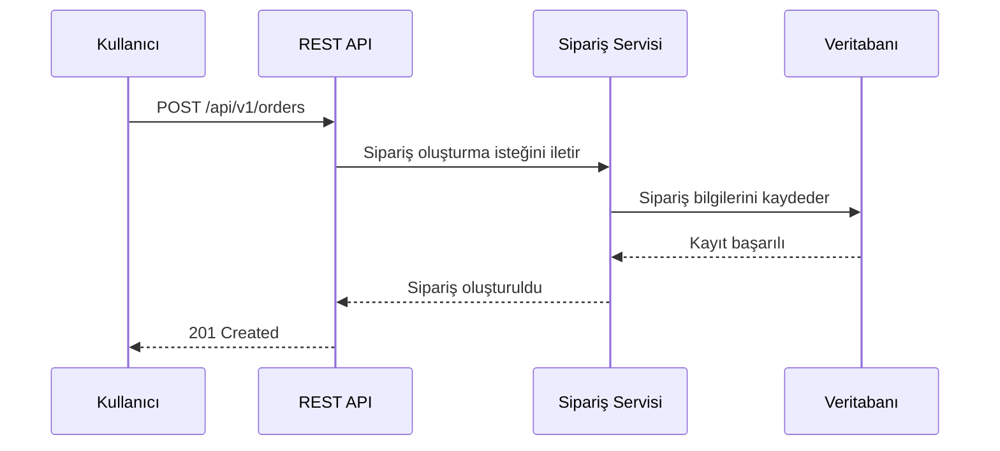

# Sequence Diagram

## Amaç

Bu diyagram, sipariş oluşturma işlemi sırasında istemci ile sistem bileşenleri arasında gerçekleşen mesajlaşma akışını göstermektedir.

---

---

# Süreç Açıklaması

1. Kullanıcı, yeni bir sipariş oluşturmak için REST API'ye istek gönderir.
2. REST API, isteği Sipariş Servisi'ne iletir.
3. Sipariş Servisi, gerekli doğrulamaları tamamladıktan sonra sipariş bilgilerini veritabanına kaydeder.
4. Veritabanı, kayıt işleminin başarılı olduğunu Sipariş Servisi'ne bildirir.
5. Sipariş Servisi, oluşturulan sipariş bilgisini REST API'ye iletir.
6. REST API, kullanıcıya **201 Created** durum kodu ile başarılı yanıt döndürür.

---

# Diyagramın Amacı

Bu diyagram, sipariş oluşturma sürecindeki bileşenler arasındaki iletişim akışını göstermektedir. Böylece isteğin sistem içerisinde hangi adımlardan geçtiği ve hangi bileşenlerin süreçte görev aldığı kolayca anlaşılabilir.
