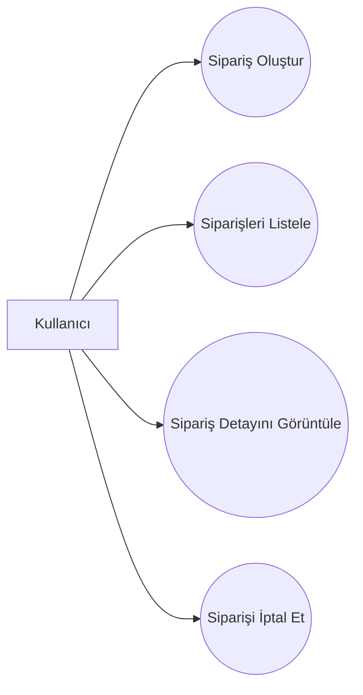

# Use Case Diagram

## Amaç

Bu diyagram, E-Ticaret Sipariş Yönetim Sistemi kapsamında kullanıcıların API üzerinden gerçekleştirebileceği temel işlemleri göstermektedir.

---

---

# Açıklama

Bu sistemde tek aktör **Kullanıcı** olarak ele alınmıştır.

Kullanıcı aşağıdaki işlemleri gerçekleştirebilir:

* Yeni sipariş oluşturabilir.
* Kendi siparişlerini listeleyebilir.
* Belirli bir siparişin detayını görüntüleyebilir.
* Uygun durumdaki siparişleri iptal edebilir.

Bu diyagram, sistemin kullanıcıya sunduğu temel işlevleri özetlemektedir.
